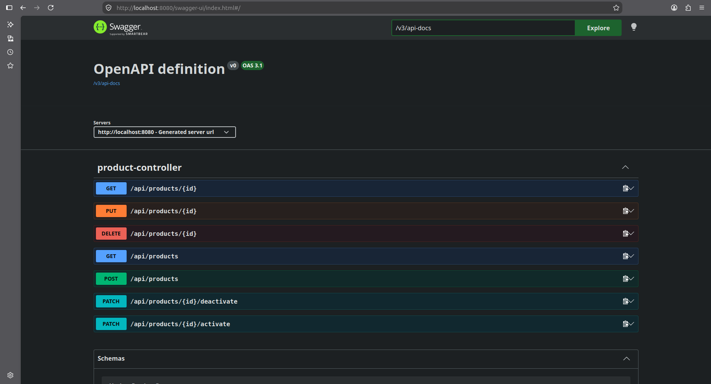

# Hexagonal Architecture Demo

Projeto de demonstração aplicando os princípios da **Arquitetura Hexagonal (Ports and Adapters)** para garantir o isolamento absoluto do domínio e regras de negócio contra dependências externas e frameworks.

---

## **Arquitetura**

O sistema foi modelado dividindo estritamente as responsabilidades em três camadas fundamentais:

```bash
src/main/java/br/com/sales/hexagonal_architecture_demo/
├── domain/                  # Core: Regras de negócio puras (Java puro)
│   ├── exception/           # Exceções de domínio
│   └── model/               # Entidades e Value Objects (ex: Product, Money)
│
├── application/             # Casos de Uso e Portas
│   ├── port/
│   │   ├── input/           # Inbound Ports (Use Cases chamados pela Web)
│   │   └── output/          # Outbound Ports (Interfaces para Persistência)
│   └── service/             # Implementações dos Casos de Uso
│
└── infrastructure/          # Adaptadores Técnicos
    ├── input/               # Inbound Adapters (REST Controllers, DTOs, Handlers)
    └── output/              # Outbound Adapters (JPA Entities, Repositories)
```

---

 ## **Regras de Dependência (Fronteiras)**

- Domain: Não possui dependências do Spring, JPA ou qualquer biblioteca externa.


- Application: Conhece apenas o Domain. Define interfaces (Ports) para comunicação externa.


- Infrastructure: Conhece Application e Domain. Implementa as portas de saída e expõe a API HTTP.

---

## **Tecnologias Utilizadas**

- Java 21

- Spring Boot 3.x

- H2 Database

- Maven

- JUnit 5 & Mockito

---

## Como Executar o Projeto

- Pré-requisitos: JDK 21 instalado, Maven 3.8+ configurado, IDE (opcional)

---

## Passos

Clone o repositório:

```bash
git clone https://github.com/HenriqueSales2/hexagonal-clean-architecture.git
```   

Entre no diretório do projeto:

```bash
cd hexagonal-clean-architecture
```

Compile e execute a aplicação via Maven:

```bash
./mvnw spring-boot:run
```
> A aplicação estará disponível em **http://localhost:8080**. Caso queira acessar a documentação com o Swagger para acessar os Endpoints sem a necessidade um Postman basta colocar no seu navegador **http://localhost:8080/swagger-ui/index.html.**
> 
> 

---

## **Executando os Testes**

Para garantir a integridade do isolamento arquitetural e das regras de negócio:

```bash
# Executa todos os testes (Unitários da Aplicação + Integração dos Controllers)
./mvnw test
```

---

## **Padronização de Commits**

Este projeto segue rigorosamente a especificação do Conventional Commits:

- chore: Tarefas genéricas ou Manutenção.

- docs: Alterar arquivos de documentação.

- feat(application): Casos de uso e portas.

- feat(domain): Novas entidades ou regras de negócio.

- feat(infrastructure): Controllers REST ou adaptadores JPA.

- refactor: Melhorias de código sem alteração de comportamento.

- style: Ajustar espaçamento, remover imports não utilizados ou formatar chaves.

- test(infrastructure): Adição de testes unitários ou de integração.